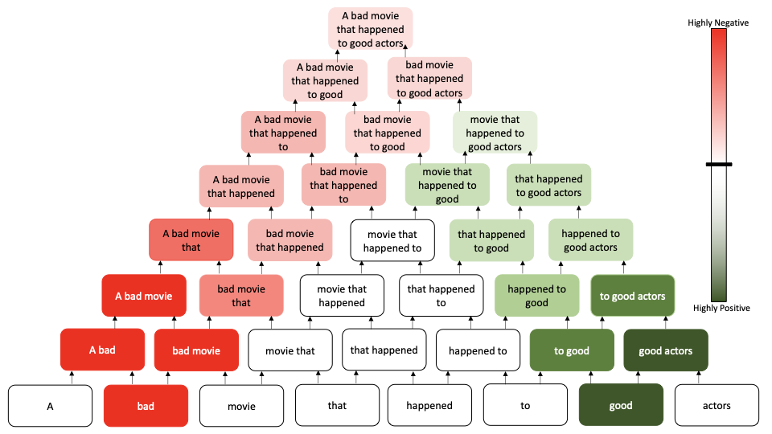

# Exclusion Inclusion
Deep Neural Networks in NLP have enabled systems to learn complex non-linear relationships amongst words and phrases. 
Yet, one of the major bottlenecks towards being able to use DNNs for real world applications is their characterization 
as black boxes. To solve this problem, we introduce a novel model agnostic algorithm which calculates phrase-wise 
importance of input features. We showcase generalizability of our method to a diverse set of tasks, by carrying out 
experiments for both Regression and Classification. We also observe that our approach works for short and long texts 
and is robust to outliers, implying that it only captures the essential aspects of the input. The details of the 
academic paper can be found [here](https://arxiv.org/abs/2007.16010).

## Setup 
To install Exclusion Inclusion (EI), run the following command.

```
$ pip install git+https://github.com/pidahbus/exclusion-inclusion
```

## Usage
To calculate the feature importance of the n-grams using the following command.

```
$ from ei import ExclusionInclusion
$ ei = ExclusionInclusion(model=model, mode="classification", max_len=52, vocab_with_index=tokens_to_idx, labels=[0, 1])
$ ei.find_enablers_and_disablers(X_without_padding=[1, 2, 3], y_true=1, importance_gram_limit=None, 
                                 effect_gram_limit=10, sequence_type="short", complete_phrase=True, 
                                 predict_batch_size=32)               
```

The details of the parameters can be found in the docstring of the functions. 

## Results
The output of EI based interpretability is showcased and explored in three different ways. Firstly, table 
below shows the actual raw `python dictionary` output from the EI algorithm for all the possible combinations of 
n-grams for the sentence "a fun ride". These EI values are calculated with respect to class 1 i.e. the positive class. 
From the table we observe that `a` and `ride` are neither positively or negatively impacting (with EI scores close to 
0), and presence of the word `fun` makes the n-gram a strong positively impacting phrase. 

| n-gram | EI Score |  
| ------ | :------: |
|a | -0.03 | 
|fun| 23.57 |  
|ride | 0.06 |  
|a fun | 22.13 | 
|fun ride| 23.02 |
|a fun ride| 24.08 |

The second method is a visual representation of the output. Figure below shows a visual representation 
of the calculation of positively and negatively impacting phrases for a sample sentence with EI. Interestingly, 
this example sentence contains both negatively impacting words/phrases (e.g. `bad`) and positively impacting 
words/phrases (e.g. `good`). The n-grams which contain only `bad` have negative EI scores and n-grams containing 
only `good` have positive EI scores. When both `bad` and `good` are present in a single n-gram, the EI scores for 
those cases are negative. This is completely intuitive, as the sentiment of the complete sentence is truly on the 
negative side. Therefore, EI shows how a trained model sees each of the n-grams to predict the sentiment of the whole 
sentence.



## Citation
This paper is submitted for publication. If you are using this model then please use the below BibTeX to cite for now.

```
@ARTICLE{2020arXiv200716010M,
       author = {{Maji}, Subhadip and {Ghosh Chowdhury}, Arijit and {Bali}, Raghav and {Bhandaru}, Vamsi M},
        title = "{Exclusion and Inclusion -- A model agnostic approach to feature importance in DNNs}",
      journal = {arXiv e-prints},
     keywords = {Computer Science - Computation and Language, Computer Science - Machine Learning, Statistics - Computation, Statistics - Machine Learning},
         year = 2020,
        month = jul,
          eid = {arXiv:2007.16010},
        pages = {arXiv:2007.16010},
archivePrefix = {arXiv},
       eprint = {2007.16010},
 primaryClass = {cs.CL},
       adsurl = {https://ui.adsabs.harvard.edu/abs/2020arXiv200716010M},
      adsnote = {Provided by the SAO/NASA Astrophysics Data System}
}
```

## More Information
For any clarification feel free to raise an issue. Additionally you can reach us at subhadipmaji.jumech@gmail.com

